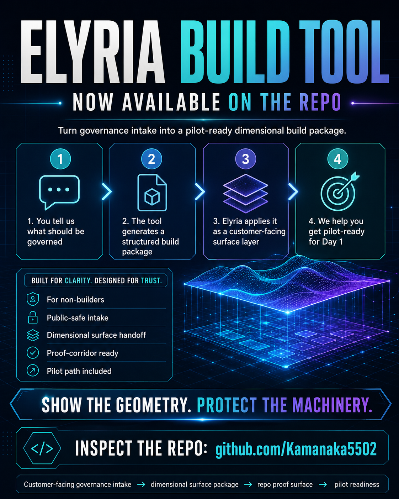
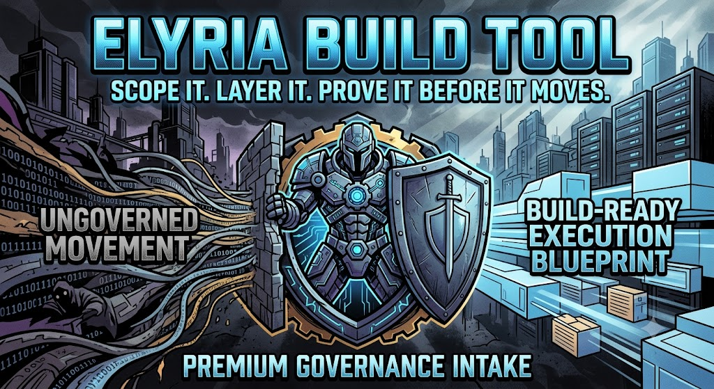

<p align="center">
  
</p>

# 🌈 **Elyria Build Tool**
## **Premium Governance Intake → Build-Ready Execution Blueprint**

> **Scope it. Layer it. Prove it before it moves.**

<p align="center">
  <a href="https://paypal.me/Samantharevita5/100">
    
  </a>
  <a href="https://paypal.me/Samantharevita5/100">
    
  </a>
</p>


**Buyer delivery contacts:**

- **Samantha Revita:** samanthagreenwellrevita@gmail.com
- **Terry Snyder:** canarybird0618@gmail.com

---

## 💠 **Buy the $100 Buyer Package**

**Elyria Build Tool** is sold as a **$100 premium governance intake package** for buyers who need to turn a vague governance concern into a **structured, build-ready blueprint**.

The buyer receives the **repo**, **CLI tool**, **sample outputs**, **buyer-facing documentation**, and a **repeatable blueprint-generation flow**.

**Best for:** **founders**, **AI builders**, **workflow owners**, **automation teams**, **consultants**, **compliance-adjacent teams**, and **technical buyers** who need to define what must be governed before movement binds consequence.

**Included for $100:**

- **Elyria Build Tool repo**
- **governance intake question flow**
- **demo blueprint generator**
- **validation command**
- **inspection command**
- **sample buyer outputs**
- **protected-scope language**
- **sales-facing documentation**
- **pilot-readiness structure**

**Not included:** **custom implementation**, **runtime engineering**, **production validators**, **proof corridor deployment**, **receipt infrastructure**, **replay infrastructure**, **integrations**, **legal advice**, **compliance certification**, or **production deployment**.

---

**Elyria Build Tool** is a customer-facing **governance intake** and **blueprint generator** for teams building **AI agents**, **workflows**, **payment approvals**, **access controls**, **recommendations**, **automations**, or other **consequence-bearing system behavior**.

It helps a buyer answer one operational question:

> **What movement should be governed before it becomes real?**

The tool turns plain-language governance concerns into a structured blueprint covering the **governed object**, **consequence boundary**, **authority requirements**, **evidence requirements**, **admit / hold / refuse matrix**, **failure modes**, **receipt requirements**, **replay requirements**, **pilot corridor plan**, **protected scope**, **commercial access boundary**, and **validation report**.

---

## ✨ **Buyer Package**

**Price:** **$100**

The **$100 buyer package** includes the **Elyria Build Tool repo** and **buyer-facing blueprint generation flow**. It is designed to help customers scope what they need governed and prepare a clean handoff package for **Elyria Systems review** or future implementation.

This package is **not custom runtime engineering**. It does not include **validators**, **enforcement code**, **proof corridor deployment**, **receipt infrastructure**, **replay infrastructure**, **integrations**, **legal advice**, **compliance certification**, or **production deployment**.

---

## 🚀 **What This Tool Is For**

Most organizations know that something inside their **AI**, **automation**, **workflow**, **infrastructure**, **finance**, **healthcare**, **legal**, **procurement**, or **operational system** needs governance.

They usually cannot describe it in **execution-boundary language**.

They may say:

- **“This workflow should not run unless approval is current.”**
- **“This agent should not touch customer records without proof.”**
- **“This payment should not bind without authority.”**
- **“This system should stop if standing changes.”**
- **“This recommendation should not become action without evidence.”**
- **“This decision needs a receipt before it becomes operational.”**
- **“This movement must be replayable later.”**

That is enough.

**Elyria Build Tool converts that input into a build-ready governance structure.**

---

## 🧭 **The Simple Model**

### **Customer Side**

The customer defines **what must be governed**.

### **Tool Side**

The tool asks structured questions about:

- **the action trying to become real**
- **the consequence that could bind**
- **who or what has authority**
- **what evidence must exist**
- **what conditions must stay true**
- **what should cause admission, hold, refusal, halt, quarantine, revoke, or escalation**
- **what receipt must be created**
- **what replay must prove**
- **what pilot success looks like**

### **Elyria Side**

**Elyria Systems** can use the generated blueprint to evaluate or build:

- **governed object definition**
- **protected execution boundary**
- **standing / admissibility rule**
- **admit / hold / refuse matrix**
- **proof-surface checklist**
- **pilot corridor plan**
- **receipt and replay requirements**
- **commercial implementation path**

---

## 🧩 **Core Outputs**

| **Output** | **Purpose** |
|---|---|
| **Build blueprint** | **Structured handoff package for implementation review** |
| **Governed object** | **The action, decision, workflow, AI behavior, payment, access event, recommendation, or system movement being governed** |
| **Consequence description** | **What could bind if invalid movement proceeds** |
| **Authority requirements** | **Who or what may admit, hold, or refuse movement** |
| **Evidence requirements** | **What must exist before movement can bind** |
| **Admit / hold / refuse matrix** | **Boundary behavior for valid, incomplete, and invalid conditions** |
| **Failure modes** | **Where governance can collapse or become inadmissible** |
| **Receipt requirements** | **What must be recorded when movement is evaluated** |
| **Replay requirements** | **What must be reproducible later** |
| **Pilot corridor plan** | **Narrow test path for first proof of governed movement** |
| **Protected scope** | **Boundary between buyer-facing intake and Elyria runtime implementation** |
| **Commercial access boundary** | **What the $100 package includes and excludes** |
| **Validation report** | **Readiness status for blueprint review** |

---

## 🛠️ **Install**

```bash
python -m venv .venv
source .venv/bin/activate
pip install -e . pytest
```

---

## ⚡ **Fast Commands**

**Show intake questions:**

```bash
elyria-build-tool questions
```

**Build a demo blueprint:**

```bash
elyria-build-tool build --demo --out sample_scope
```

**Validate a blueprint:**

```bash
elyria-build-tool validate sample_scope/elyria_build_blueprint.json
```

**Inspect a blueprint:**

```bash
elyria-build-tool inspect sample_scope/elyria_build_blueprint.json
```

**Run tests:**

```bash
pytest -q
```

**Module form also works:**

```bash
python -m elyria_build_tool questions
```

---

## 🧪 **Day 1 Pilot Posture**

Day 1 is **not a vague discovery call**.

A serious pilot begins with:

- **one governed object**
- **one consequence boundary**
- **one authority requirement**
- **one evidence requirement**
- **one admit case**
- **one hold case**
- **one refuse case**
- **one changed-condition case**
- **one receipt requirement**
- **one replay requirement**
- **one no-effect expectation when movement is refused**

The pilot begins when the customer can point to a movement and say:

> **This is the thing we do not want becoming real unless standing resolves first.**

---

## 🔐 **Protected Scope**

This tool is **buyer-facing** and **public-safe**.

It does **not** disclose protected **Elyria Systems substrate**, **live runtime internals**, **private validators**, **production enforcement code**, **deployment machinery**, or **customer-specific implementation material**.

The rule is:

> **Show the governance surface. Do not disclose the protected machinery.**

Customers define the movement.  
**Elyria Systems performs protected runtime implementation separately.**

---

## 🌊 **Why This Matters**

This is **not another dashboard**.

This is **not another checklist**.

This is **not another policy document**.

The category is stricter:

> **Before a system movement becomes consequence, it must prove standing.**

If standing resolves, movement may be **admitted**.

If standing does not resolve, movement must **hold**, **narrow**, **escalate**, **refuse**, **halt**, **quarantine**, **revoke**, **rebound**, or **leave no protected effect**.

That is the difference between **documenting governance** and **building a consequence boundary**.

---

## 📦 **Commercial Path**

```text
Customer governance concern
        ↓
Elyria Build Tool intake
        ↓
Generated governance blueprint
        ↓
Elyria Systems review
        ↓
Pilot corridor design
        ↓
Runtime / proof implementation
        ↓
Production licensing path
```

---

## ✅ **Benchmark Posture**

This package is designed to support:

- **customer-friendly intake**
- **build-ready handoff**
- **protected-scope boundary**
- **public-safe proof surface**
- **pilot corridor preparation**
- **receipt / replay requirement**
- **refusal / halt / no-effect expectation**
- **commercial implementation path**

---

## 🧾 **Core Line**

> **The customer tells us what must be governed.**  
> **The tool converts it into a build-ready governance blueprint.**  
> **Elyria Systems builds the protected runtime layer separately.**  
> **No proof surface, no category claim.**

## **Buy the Elyria Build Tool — $100**

The **Elyria Build Tool buyer package** is available for **$100**.

[**Buy Now — $100 via PayPal**](https://paypal.me/Samantharevita5/100)

After payment, include your **email address** and **GitHub username** in the PayPal note so delivery/access can be issued.

For delivery or buyer-access questions, contact:

- **Samantha Revita:** samanthagreenwellrevita@gmail.com
- **Terry Snyder:** canarybird0618@gmail.com

### **Access Boundary**

Purchase gives access to the **intake and blueprint package**.

It does **not** include **custom Elyria Systems implementation**, **production runtime deployment**, **proof corridor engineering**, **integrations**, **compliance certification**, **legal advice**, or **ongoing support** unless separately agreed.

**Pull requests are not required for purchase or customer access. Pull requests are only for proposed code or documentation contributions.**

---

<p align="center">
  
</p>
